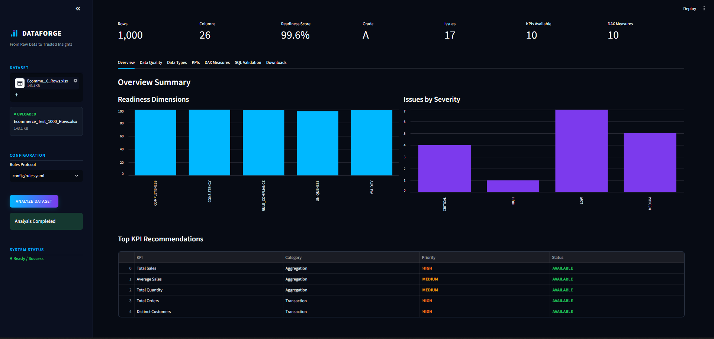
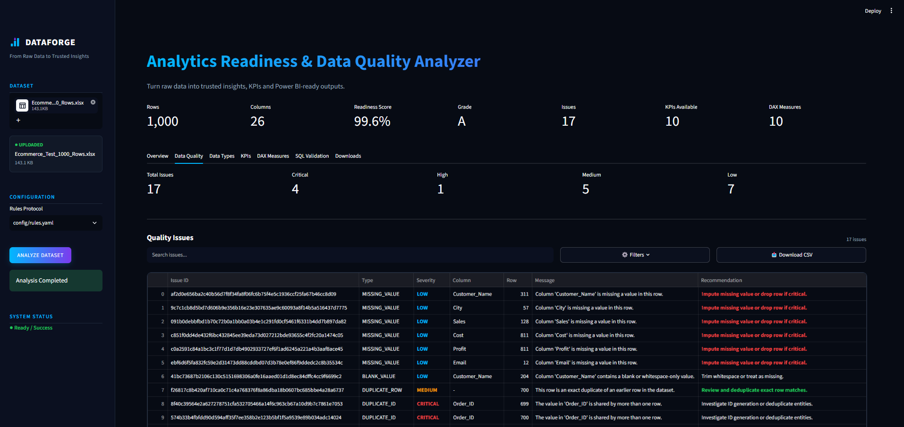
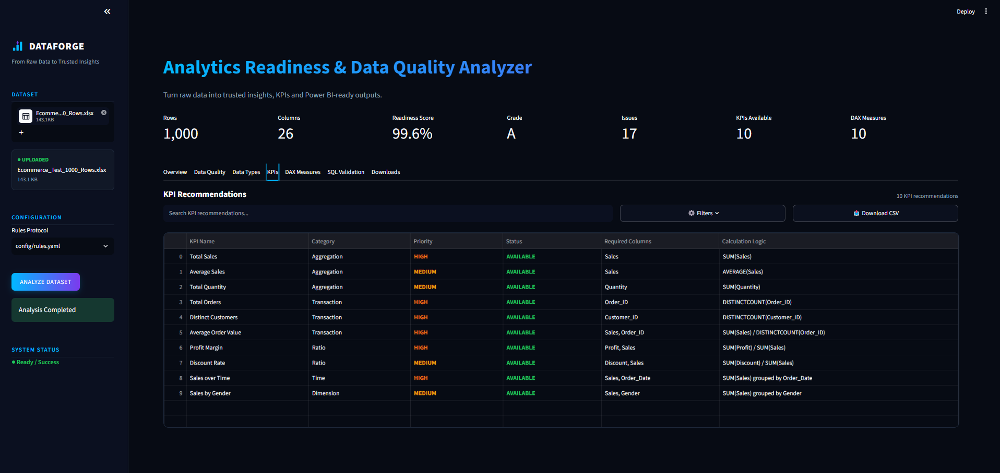
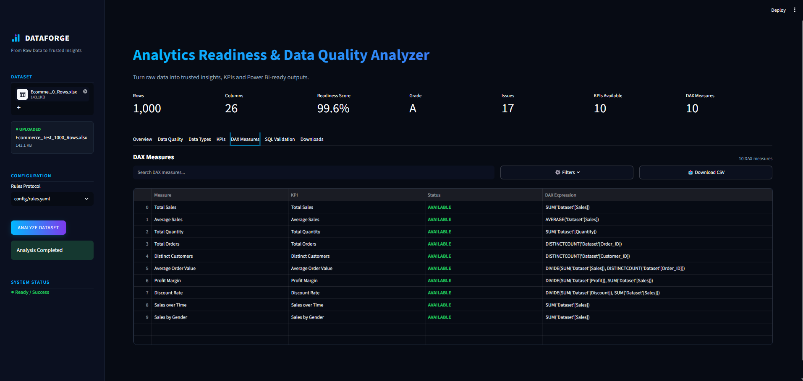
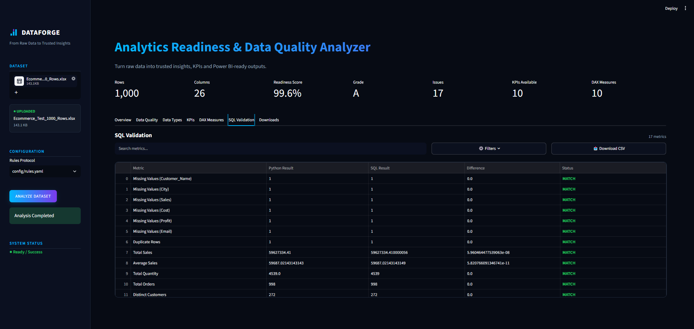

# DATAFORGE

### From Raw Data to Trusted Insights

DATAFORGE is a deterministic analytics-readiness and data-quality platform that transforms raw CSV/XLSX datasets into trusted analytical outputs, KPI recommendations, DAX measures, SQL validation results, and Power BI-ready reports.

Built as a portfolio-grade Data Analytics project using Python, Pandas, DuckDB, Streamlit, Plotly, and Power BI.


---

## 🚀 What is DATAFORGE?

Raw datasets often contain missing values, invalid values, duplicate records, inconsistent fields, and business-rule violations.

DATAFORGE analyzes a dataset before it reaches the dashboarding stage.

It answers questions such as:

* Is the dataset ready for analytics?
* What data-quality issues exist?
* Which columns are valid and what do they represent?
* Which business rules are violated?
* What is the overall analytics-readiness score?
* Which KPIs can actually be calculated?
* Which DAX measures can be generated safely?
* Do Python and SQL calculations agree?
* What outputs are ready for Power BI?

The goal is to move from:

**Raw Data → Trusted Data → KPIs → BI-ready Outputs**

---

## 🎯 Why DATAFORGE?

Traditional dashboard workflows often begin with raw data and jump directly into visualization.

DATAFORGE adds an analytical validation layer first:

**Ingest → Profile → Validate → Score → Recommend → Generate → Export**

This helps reduce the risk of building dashboards on incomplete, inconsistent, or poorly understood data.

---

## ✨ Key Features

### 📥 Dataset Ingestion

* CSV support
* XLSX support
* Dataset-level metadata
* Safe handling of malformed inputs

### 📊 Data Profiling

* Row and column counts
* Null counts and percentages
* Unique values
* Minimum / Maximum
* Mean / Median
* Storage-type detection

### 🧠 Semantic Type Detection

Automatically identifies useful semantic roles such as:

* ID
* Category
* Currency
* Percentage
* Date / DateTime
* Integer
* String

### 🔎 Data Quality Analysis

Detects issues such as:

* Missing values
* Blank values
* Duplicate rows
* Duplicate IDs
* Invalid emails
* Invalid dates
* Invalid numeric values
* Range violations
* Category violations
* Consistency problems

### 📋 Business Rule Engine

Supports configurable rules such as:

* Required columns
* Numeric ranges
* Allowed values
* Uniqueness
* Column comparisons
* Referential integrity

Rules are maintained separately in YAML configuration.

### 📈 Analytics Readiness Scoring

Produces a deterministic score from **0–100** across dimensions including:

* Completeness
* Validity
* Consistency
* Uniqueness
* Rule Compliance

### 💡 KPI Recommendation Engine

Recommends KPIs only when required data is actually available.

Examples:

* Total Sales
* Total Quantity
* Total Orders
* Distinct Customers
* Average Sales
* Average Order Value
* Profit Margin

Each KPI can be classified as:

* `AVAILABLE`
* `UNAVAILABLE`
* `REQUIRES_REVIEW`

### 🧮 DAX Measure Generator

Generates Power BI-ready DAX suggestions for supported KPIs.

Examples include:

* `SUM`
* `AVERAGE`
* `DISTINCTCOUNT`
* `DIVIDE`
* Average Order Value
* Profit Margin

### 🗄️ SQL Validation

Uses DuckDB to compare Python calculations with SQL equivalents.

Validation states:

* `MATCH`
* `MISMATCH`
* `NOT_AVAILABLE`

Floating-point comparisons use tolerance-based matching where appropriate.

### 📤 Power BI Preparation

Generates Power BI-ready CSV outputs including:

* Dataset profile
* Column metadata
* Quality issues
* Quality summary
* Readiness score
* KPI recommendations
* DAX measures

### 🖥️ Streamlit Dashboard

Provides an interactive dashboard for:

* Dataset upload
* Analysis
* Data quality exploration
* Semantic-type inspection
* KPI recommendations
* DAX measures
* SQL validation
* Report downloads

---

## 🏗️ Architecture

```text
CSV / XLSX
    │
    ▼
Data Ingestion
    │
    ▼
Profiling
    │
    ▼
Semantic Type Detection
    │
    ├──────────────────────┐
    ▼                      ▼
Quality Engine       Business Rules
    │                      │
    └──────────┬───────────┘
               ▼
        Issue Management
               │
               ▼
       Readiness Scoring
               │
       ┌───────┼────────┐
       ▼       ▼        ▼
      KPI     DAX      SQL
     Engine  Engine   Analyzer
       │       │        │
       └───────┼────────┘
               ▼
      Power BI-ready Outputs
               │
               ▼
      Streamlit Dashboard
```

---

## 🖥️ Streamlit Dashboard

DATAFORGE includes a modern dark analytics dashboard for analyzing CSV and XLSX datasets without requiring users to manually place files into the project's `data/` directory.

### Workflow

```text
Upload Dataset
      ↓
Analyze Dataset
      ↓
Overview
      ↓
Data Quality
      ↓
Data Types
      ↓
KPI Recommendations
      ↓
DAX Measures
      ↓
SQL Validation
      ↓
Download Reports
```

### Dashboard Overview



### Data Quality



### KPI Recommendations



### DAX Measures



### SQL Validation



---

## 🧪 Testing & Validation

The project currently has:

**260 tests passing**

Testing covers:

* Unit testing
* Integration testing
* Ground-truth testing
* Edge-case testing
* KPI testing
* DAX testing
* SQL validation testing
* Report generation
* Streamlit integration

The test suite is designed to protect earlier analytical phases from regressions introduced by later components.

---

## 📊 Ground-Truth Benchmark

A controlled synthetic dataset is used to evaluate issue-detection performance.

| Metric          | Result |
| --------------- | -----: |
| True Positives  |     16 |
| False Positives |      0 |
| False Negatives |      0 |
| Precision       |   100% |
| Recall          |   100% |
| F1 Score        |   100% |

> These results are specific to the controlled synthetic benchmark and do not represent universal real-world accuracy.

---

## 📥 Input

Supported file formats:

* `.csv`
* `.xlsx`

The dataset should contain structured tabular data.

Example fields:

```text
Order_ID
Customer_ID
Order_Date
Category
Quantity
Sales
Profit
Discount
```

---

## 📤 Outputs

DATAFORGE generates Power BI-ready reports such as:

```text
output/
├── dataset_profile.csv
├── column_metadata.csv
├── quality_issues.csv
├── quality_summary.csv
├── readiness_score.csv
├── kpi_recommendations.csv
└── dax_measures.csv
```

---

## 🛠️ Tech Stack

### Core

* Python
* Pandas
* NumPy

### Analytics & Data Quality

* PyYAML
* DuckDB

### Interface

* Streamlit
* Plotly

### Testing

* Pytest
* Hypothesis

### Business Intelligence

* Power BI
* DAX

---

## 📁 Project Structure

```text
Dataforge/
│
├── app.py
├── .gitignore
├── pyproject.toml
├── requirements.txt
│
├── config/
│   └── rules.yaml
│
├── docs/
│   ├── ground_truth_report.md
│   └── powerbi_dashboard_spec.md
│
├── src/
│   ├── ingestion.py
│   ├── profiler.py
│   ├── type_detector.py
│   ├── quality_engine.py
│   ├── rules.py
│   ├── issue_manager.py
│   ├── scoring.py
│   ├── kpi_engine.py
│   ├── dax_generator.py
│   ├── sql_analyzer.py
│   ├── report_generator.py
│   └── main.py
│
└── tests/
```

---

## ⚙️ Installation

### 1. Clone the repository

```bash
git clone https://github.com/kartikmalaviya11/Dataforge.git
cd Dataforge
```

### 2. Create a virtual environment

Windows PowerShell:

```powershell
python -m venv .venv
```

### 3. Activate the environment

```powershell
.venv\Scripts\Activate.ps1
```

### 4. Install dependencies

```powershell
pip install -r requirements.txt
```

---

## ▶️ Run the Streamlit App

Start the application:

```powershell
streamlit run app.py
```

Then:

1. Upload a CSV or XLSX file.
2. Select the business-rule configuration if required.
3. Click **Analyze Dataset**.
4. Explore the dashboard tabs.
5. Download the generated reports.

---

## 💻 CLI Usage

The analytical engine can also be used without Streamlit.

Example:

```powershell
python -m src.main analyze data/your_dataset.xlsx --rules config/rules.yaml --output output/
```

This runs the analytical pipeline and writes the generated reports to the specified output directory.

---

## 📋 Business Rules

Business rules are configured in:

```text
config/rules.yaml
```

Supported rule categories include:

* Required columns
* Range validation
* Allowed values
* Uniqueness
* Comparisons
* Referential integrity

Rules are configuration-driven rather than hard-coded into the quality engine.

---

## 🔎 Data Quality Philosophy

DATAFORGE follows several design principles:

* Deterministic
* Explainable
* Testable
* Configuration-driven
* No silent assumptions
* No invented KPIs
* No fake DAX
* No fabricated benchmark results
* Graceful handling of unsupported or ambiguous inputs

The system prefers a clear `UNAVAILABLE` or `NOT_AVAILABLE` state over generating misleading analytical results.

---

## ⚠️ Known Limitations

* KPI recommendations are based on semantic detection and deterministic heuristics.
* Some domain-specific KPIs may require custom business configuration.
* Advanced Power BI time intelligence requires an appropriate date-table model.
* Grouped SQL validation is limited where scalar comparison is not semantically equivalent.
* The ground-truth benchmark is controlled and does not represent universal production accuracy.
* Real-world datasets may require dataset-specific business rules.

---

## 🗺️ Future Improvements

Potential future improvements include:

* Advanced date-table-aware DAX generation
* Multi-table relationship detection
* More domain-specific KPI templates
* Historical readiness tracking
* Automated Power BI model generation
* Deployment-ready hosted dashboard
* More advanced semantic role detection

---

## 👨‍💻 Author

**Kartik Malaviya**

BCA Student | Aspiring Data Analyst

Interested in:

* Data Analytics
* SQL
* Python
* Power BI
* Business Intelligence
* Data Quality
* Analytics Engineering

GitHub: [@kartikmalaviya11](https://github.com/kartikmalaviya11)

---

## 📄 License

This project is intended as a personal portfolio and learning project.

See the repository for licensing information before reuse or redistribution.
